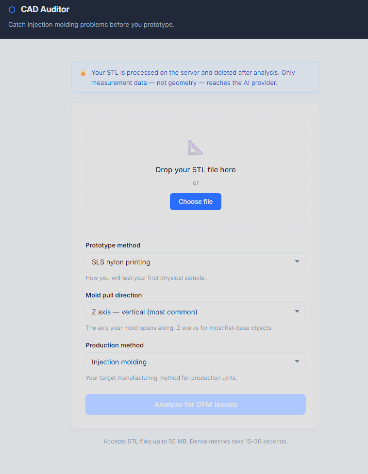

# CAD Auditor

DFM reviewer for injection molding and resin casting. Upload an STL file, select your prototype and production method, and get a structured report separating what needs fixing before your first prototype from what needs fixing before production tooling — with a 3D view showing exactly which faces are flagged.

## The Problem

Injection molding tooling costs between $10,000 and $100,000 and cannot be revised cheaply once cut. Resin casting silicone molds cost $300 to $1,500 but produce parts whose quality is entirely determined by design decisions made before the first pour. Most DFM failures in both processes are detectable from geometry alone: zero draft causes parts to seize in injection molds, undercuts add $2,000 to $8,000 per side action, and inconsistent wall thickness causes sink marks on cosmetic surfaces regardless of manufacturing method. For first-time product entrepreneurs without in-house tooling engineers, this review either does not happen or happens after money is already committed. CAD Auditor automates the geometric check that catches these failures while the cost of fixing them is still zero.

## Dashboard

The browser dashboard renders after upload. No setup required beyond cloning the repo and running the server.



*Screenshot pending. Run locally with `uvicorn src.web.app:app --reload` and upload any STL to see the dashboard.*

## What It Catches

| Check | What it measures | Injection molding threshold | Resin casting threshold |
|---|---|---|---|
| Draft angles | Face normal alignment vs. pull direction | Less than 1.0° flagged | Advisory only — silicone releases without draft |
| Wall thickness | Ray casting distance through solid | Less than 1.5mm or greater than 4.0mm | Less than 0.5mm flagged |
| Undercuts | Face normals opposing pull direction | More than 15° past perpendicular — side action required | Acceptable — silicone stretches over undercuts |
| Rib thickness proxy | Local thickness vs. nominal wall ratio | Greater than 60% of nominal wall | Same threshold — sink marks occur in both processes |
| Sharp corners | Interior dihedral angle at mesh edges | Less than 45° flagged | Same threshold — stress concentration in cured resin |

All five checks run on every submission regardless of production method. Severity labels are overridden per-check based on what actually matters for the chosen process.

## Architecture and Design Decisions

Each decision below names the alternative that was rejected and the reason it lost.

**Input format: STL over STEP.**
STL represents a 3D surface as triangles with normals and nothing more. STEP is richer and preserves feature semantics, tolerances, and parametric constraints. STEP was rejected because parsing it requires pythonOCC, which wraps OpenCASCADE and has notoriously difficult installation on Windows. STL exports from every CAD tool in two clicks, installs cleanly via trimesh, and is sufficient for all five geometric checks. Limitation: rib detection from STL is a proxy because the format carries no feature labels.

**Geometry library: trimesh over Open3D and VTK.**
Open3D is strong for point cloud processing but its mesh analysis is secondary. VTK is industrial grade but requires verbose object-pipeline setup for simple queries. trimesh is purpose-built for mesh analysis, provides face normals automatically on load, integrates ray casting directly, and installs cleanly on Windows. One dependency gap was discovered during development: trimesh's ray casting requires the `rtree` package, which it does not pull in automatically.

**Separation of geometry and interpretation.**
The model never computes geometry. Draft angles are trigonometry: the dot product of a face normal with the pull direction, passed through arcsin. Wall thickness is geometry: a ray cast inward from the surface returns the distance to the opposite wall. All five checks produce structured Python dicts with counts, percentages, and measurements before the model sees anything. The model receives those numbers and produces natural language interpretation. Geometric findings are fully deterministic and reproducible regardless of model behavior. Swapping the model or changing the prompt cannot alter a measurement.

**Face indices stripped from the LLM prompt but preserved in the API response.**
On a 335,930 face mesh, the flagged face index list from the draft check alone produced a prompt of 1,120,344 tokens, exceeding the context window. Face indices carry no interpretable meaning for a language model. The fix strips index lists before serialization to the prompt but preserves them in the API JSON response so the 3D viewport renderer can color individual flagged faces. This is a clean separation: the LLM never sees raw geometry references, and the 3D renderer never needs to make its own API call.

**Web layer: FastAPI over Flask.**
FastAPI was chosen because it uses Pydantic for automatic request and response validation, generates API documentation automatically, and handles file uploads via `python-multipart` with minimal configuration. More importantly, FastAPI is the current industry default for Python AI backends at growth-stage companies. The geometry pipeline runs synchronously inside the endpoint because trimesh and numpy operations are CPU-bound, not I/O-bound. Using `async def` with CPU-bound work blocks the event loop. For a local server with one user at a time, synchronous is correct. A production deployment at scale would require moving geometry processing to a background task queue.

**Two-stage reporting design.**
The report separates findings into two sections: what needs fixing before the current prototype attempt, and what needs fixing before production tooling. The split is governed by the chosen prototype method. SLS, FDM, and resin printing are forgiving on draft, undercuts, and wall thickness down to 0.5mm to 1.0mm depending on process. Injection molding and resin casting are strict on different criteria. A single list of findings ordered only by severity produces noise that erodes user trust: a draft violation that is irrelevant to the SLS prototype and critical to the injection mold should be clearly labeled, not mixed with findings that need action immediately. The `stage.py` module applies `stage_relevance` labels to each check based on prototype method thresholds.

**Production method severity overrides.**
The geometry pipeline runs against fixed injection molding thresholds because those are the defaults. For resin casting, the same geometry produces different risk profiles: draft violations are advisory because silicone releases without draft, undercut findings are non-issues because silicone stretches over them, and wall thickness minimum drops from 1.5mm to 0.5mm. The `stage.py` module computes `effective_severity` for each check based on the production method selected and passes both raw and effective severity to the frontend and interpretation layer. The LLM receives effective severity, so the interpretation reflects what actually matters for the chosen process, not what would matter for injection molding.

**Knowledge base: structured JSON injection over RAG.**
The knowledge base covers fourteen injection molding topics and twelve resin casting topics across four JSON files. RAG was evaluated and rejected. The domain is compact and fully known in advance: every relevant DFM rule for injection molding and resin casting can be written down, reviewed, and corrected. RAG adds retrieval latency, embedding cost, a vector database dependency, and non-deterministic chunk selection for a knowledge corpus that fits comfortably in a single context window. Structured injection is deterministic, auditable, and gives complete control over what the model sees. The `loader.py` module selects which rules to include based on which checks flagged and which production method is active, keeping the prompt focused rather than dumping the entire knowledge base on every call.

**IP protection: measurements only reach the API.**
The STL file is written to a temporary server path, processed, and deleted in a `finally` block regardless of whether processing succeeds or fails. The geometry pipeline extracts counts, percentages, measurements, and severity labels. Only those structured measurements are serialized to the Anthropic API. Raw geometry, face coordinates, and vertex data never leave the server. This is the honest IP protection argument for entrepreneurs whose design is their primary competitive asset.

**3D viewport: Three.js with per-face coloring.**
The viewport renders the STL mesh in the browser using Three.js loaded from a CDN via importmap, requiring no build step. The face index arrays from the draft angle and undercut checks are preserved in the API response and passed to the viewer. Each face is colored based on which checks flagged it: red for draft violations, orange for undercuts, neutral gray for all others. Wall thickness and rib proxy cannot be highlighted because both use sampling rather than per-face analysis, so they do not produce face index lists. Layer toggles allow each check's highlighting to be turned on and off independently. Click-to-card raycasting connects flagged faces in the viewport to their corresponding finding cards in the report.

**Pull direction as required user input.**
Determining the optimal pull direction for a complex part is a research problem in computational geometry that tools with full CAD kernel access have not fully solved. Requiring the user to specify it forces an explicit manufacturing intent decision before analysis runs. The default is Z, handling the most common case for parts with a flat base.

## Install and Run

### Web dashboard (recommended)

```bash
git clone https://github.com/by-carrot/cad-auditor
cd cad-auditor
python -m venv .venv
.venv\Scripts\activate        # Windows
# source .venv/bin/activate   # macOS / Linux
pip install -r requirements.txt
```

Copy `.env.example` to `.env` and add your Anthropic API key:

```
ANTHROPIC_API_KEY=your_key_here
```

Start the server:

```bash
uvicorn src.web.app:app --reload
```

Open `http://127.0.0.1:8000` in your browser. Upload an STL file, select your prototype and production method, and click Analyze.

**Note on installation:** trimesh's ray casting engine requires the `rtree` package, which is not pulled in automatically. If you see `ModuleNotFoundError: No module named 'rtree'`, run `pip install rtree`.

### CLI (geometry checks without web interface)

```bash
python -m src.main --file path/to/part.stl --pull-direction Z
```

To skip LLM interpretation and run geometry checks only:

```bash
python -m src.main --file path/to/part.stl --pull-direction Z --no-interpret
```

CLI output is written to the `output/` directory as JSON and markdown.

## Run the Tests

```bash
pytest tests/ -v
```

Expected output: 56 passed in under 1 second. All tests cover the deterministic geometry layer. The web layer and LLM interpretation are not tested because they depend on external state.

## Project Structure

```
cad-auditor/
├── src/
│   ├── main.py                  CLI entry point
│   ├── load_geometry.py         STL validation and mesh loading
│   ├── draft_check.py           Draft angle analysis
│   ├── thickness_check.py       Wall thickness via ray casting
│   ├── undercut_check.py        Undercut detection
│   ├── feature_check.py         Rib proxy and sharp corner checks
│   ├── aggregate.py             Orchestrates all five checks
│   ├── interpret.py             Anthropic SDK call and two-stage prompt design
│   ├── report.py                JSON and markdown output (CLI only)
│   ├── stage.py                 Stage relevance labels and production severity overrides
│   ├── knowledge/
│   │   ├── loader.py            Builds knowledge context string for the prompt
│   │   └── data/
│   │       ├── dfm_rules.json           14-entry injection molding knowledge base
│   │       ├── materials.json           5 common plastic material profiles
│   │       ├── collectibles.json        Collectible form object specific rules
│   │       └── resin_casting_rules.json 12-entry resin casting knowledge base
│   └── web/
│       ├── __init__.py
│       └── app.py               FastAPI application and /analyze endpoint
├── static/
│   ├── index.html               Single-page dashboard
│   ├── style.css                Dashboard styling
│   ├── app.js                   Upload form, analysis flow, results rendering
│   └── viewer.js                Three.js 3D viewport with per-face severity coloring
├── tests/
│   └── test_geometry_checks.py
├── eval/
│   └── cases.json               4-case labeled evaluation set
├── sample_stl/
├── requirements.txt
└── README.md
```

## Evaluation Results

**Test box (30 x 20 x 10mm solid box, 12 faces):** All five checks produced expected results. Draft flagged all four side walls at zero degrees. Thickness reported approximately 10mm through the solid, above the 4mm maximum. Undercuts flagged the bottom face at alignment score of negative 1.0 against Z pull. Sharp corners passed at 90 degrees above the 45 degree threshold. Rib proxy flagged 100% of samples above the 4.17mm threshold. Overall severity HIGH as expected for a solid rectangular block.

**Real casing part (90 x 35 x 110mm, 335,930 faces):** 26.0% of faces flagged for draft violations. 40.6% flagged as potential undercuts, which on a casing with internal geometry and mating features likely includes intentional undercuts accommodated in the tooling design. Maximum measured thickness of 91.38mm indicates an uncored solid region. 167 sharp edges below the 45 degree threshold. This run also revealed a context window overflow bug on dense meshes, fixed in the face index stripping commit.

**Known limitations reported honestly:**
- Rib detection is a thickness distribution proxy. True rib identification requires parametric CAD feature data not present in STL format.
- Undercut detection is a first-order approximation based on face normal alignment. Full shadow volume computation is out of scope.
- Wall thickness uses sampling (500 points by default). Localized thin regions between sample points may be missed on complex geometry.
- Pull direction must be specified by the user. The tool does not infer it.
- STL carries no unit metadata. The tool assumes millimeters, which is the injection molding and resin casting convention.
- 3D face highlighting covers draft angle and undercut checks only. Wall thickness and rib proxy use sampling and do not produce per-face index lists.

## Knowledge Base Sources

Injection molding rules are sourced from: Protolabs design tips library, Fictiv injection molding design guide, ZetarMold gate types guide, Xometry surface finish reference, and Malloy, *Plastic Part Design for Injection Molding*, Hanser, 2nd ed. 2010.

Resin casting rules are sourced from: WayKen vacuum casting design guide, SyBridge Technologies critical design guidelines for urethane casting, Formlabs vacuum casting guide, GD Prototyping Shore hardness chart, RAMPF/Innovative Polymers painting cast urethane parts guide, and Wortmann et al. 2022, *Industrial-Scale Vacuum Casting with Silicone Molds: A Review*, Applied Research, Wiley.

## Status

**Complete:**
- Five geometry checks with 56 passing tests
- 4-case labeled evaluation set with 4/4 passing
- LLM interpretation via Anthropic SDK with two-stage prompt structure
- JSON and markdown report output (CLI)
- CLI with configurable thresholds
- FastAPI web layer with single `/analyze` endpoint
- Browser dashboard with severity banner, mesh summary, manufacturing context panel, and per-check finding cards
- Two-stage report separating prototype-stage from production-stage findings
- Production method selection: injection molding and resin casting
- Production method severity overrides for resin casting (draft advisory, undercuts pass, wall threshold 0.5mm)
- Three.js 3D viewport with per-face draft and undercut highlighting, layer toggles, orbit controls, and click-to-card raycasting
- Injection molding knowledge base: 14 sourced entries covering all five checks plus gate types, runner systems, venting, surface finish standards, bosses, weld lines, ejector pins, secondary operations, and common defects
- Resin casting knowledge base: 12 sourced entries covering process overview, per-check guidance, common defects, pour gate design, master pattern quality, Shore hardness selection, in-mold inserts, overmolding, post-processing, and color matching
- Validated against real part geometry at 335,930 face density
- IP protection: STL deleted after processing, only measurements reach Anthropic API

**Planned:**
- Dashboard screenshot in README
- Resin casting as selectable prototype method (currently injection molding and resin casting are production methods; SLS, FDM, and resin are prototype methods)
- Configurable thresholds in the web UI
- PDF report download
- Targeted face highlighting for wall thickness and rib proxy once per-region sampling is added
